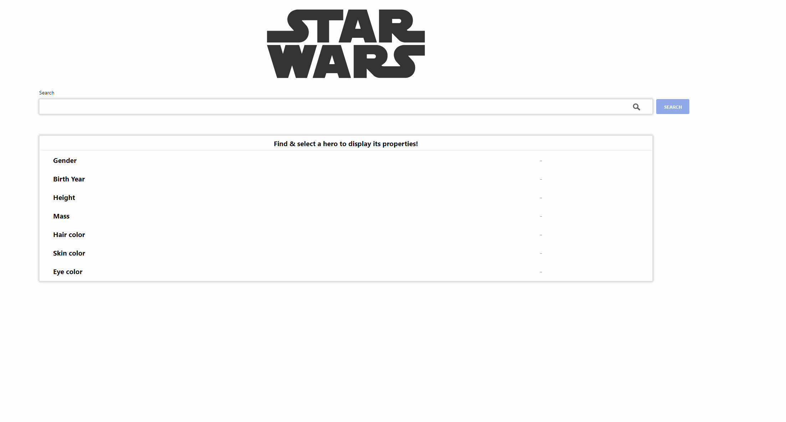

# Overview

From a code challenge:

We want you to develop a small single page app, that shows us all the information related to
a character from the Star Wars universe.
Basically, the user submits the name of the character he is looking for, in order to see all the
relevant information in a dedicated area.

- API link: https://swapi.dev/documentation - start

# Demo

Live: https://manos-liakos.dev/starwars-autocomplete/

# Features

- Live character search.
- Character related information displayed in dedicated area, upon selection.
- Custom debouncing hook to limit requests while typing.
- Request cancelation to prevent race conditions.
- Simple caching mechanism using the localStorage API. Each keyword:results pair is stored.
- Results arrow navigation.

Note: The search button is decorative. Search is performed automatically during typing.

# Installation / Usage

## Using the development build

1. Download and install the latest LTS version of Node.js.
2. Open a terminal in root directory and run `npm install`, to install all the necessary node modules.
3. When finished run `npm start` to start the development server.
4. Open a browser and visit 'localhost:3000'.

## Using the production build

### Building a production version

1. Open a terminal in "problem_2" directory and run `npm run-script build`.

### Using a local static file server

1. Once project building is finished, run `npm install -g serve` to install a local static file server.
2. Run `serve -s build` to start the app.
3. Visit localhost:5000 (see instructions in terminal).

# Testing

**_Important Note:_** Before you run any tests, make sure the app is running on http://localhost:3000. If the app is not running, follow the steps mentioned in the above section.

To run all test suites, open a terminal in root directory and type `npm test`.
